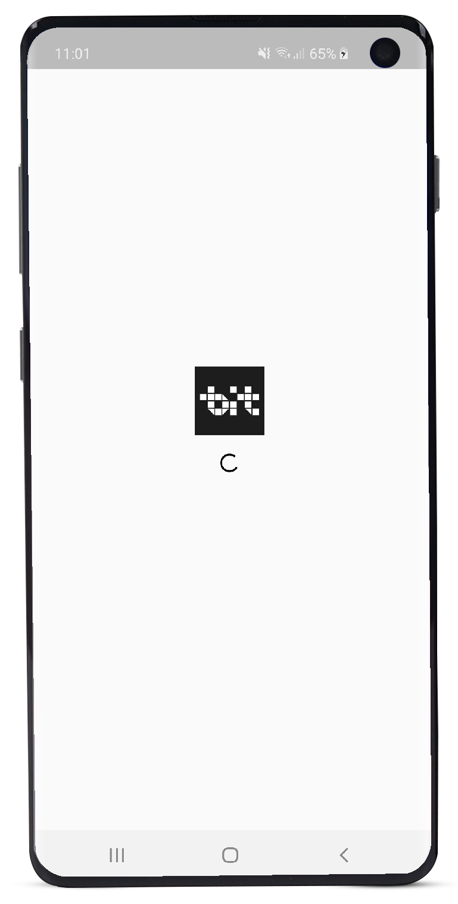

# Bicol IT App

An entry for Flutter Hackathon 2019, Philippines. UPDATE: Won [Top 9](https://harvz.link/0xb588w) out of 30+ entries and 85 participants.

# Screenshots

<span>
	
	
	
</span><br/>
<span>
	
	
	
</span><br/>
<span>
	
	
	
</span>

## Setup

### Missing Key.Properties file

Running the project straight away will get you an error regarding a `key.properties` file that is missing. To fix it,

1.  Open `android/app/build.gradle` file and comment the following lines-

```
//keystoreProperties.load(new FileInputStream(keystorePropertiesFile))

signingConfigs {
// release {
// keyAlias keystoreProperties['keyAlias']
// keyPassword keystoreProperties['keyPassword']
// storeFile file(keystoreProperties['storeFile'])
// storePassword keystoreProperties['storePassword']
// }
}
buildTypes {
// release {
// signingConfig signingConfigs.release
// }
}
```

2. Open `android` folder, look for `local.properties` file (create if it does not exist), and add the following lines-

```
flutter.buildMode=debug
flutter.versionName=1.0.0
flutter.versionCode=1
```

3.  And you're good to go. Open the project on your cmd or terminal, and type-

```
flutter run
```

## Developer

### Harvz

Hi! I'm Harvz, the developer of this project. Let's get connected!

<a href="https://harveyjavier.github.io"></a>
<a href="https://play.google.com/store/apps/dev?id=4935714394750436171"></a>
<a href="https://www.linkedin.com/in/harvz/"></a>
<a href="https://www.facebook.com/harvzjavier"></a>
<a href="https://www.instagram.com/harvzjavier/"></a>

## License

This project is licensed under the MIT License - see the [LICENSE](LICENSE) file for details.
